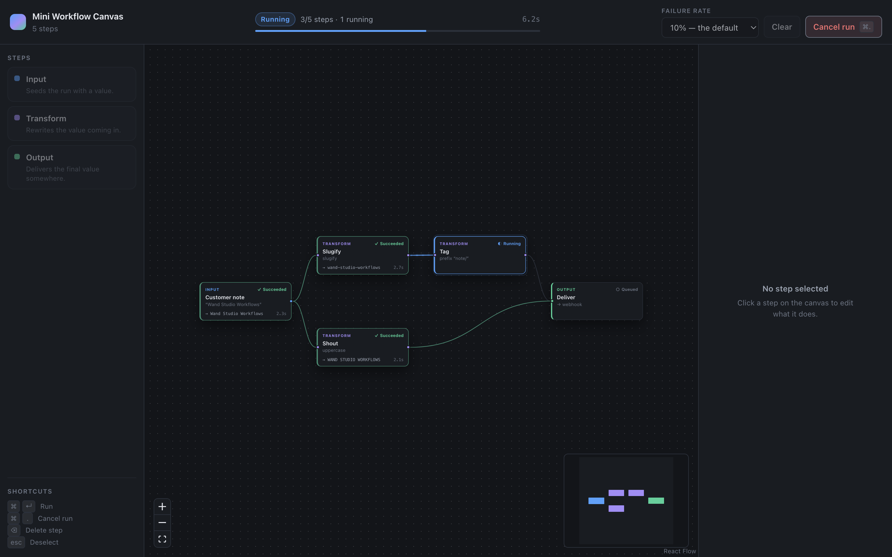

# Mini Workflow Canvas

Compose a workflow of connected steps on a canvas, run it, and watch execution
stream back in live.



<sub>Mid-run. Each step shows the value it produced and how long it took; `Cancel run` stays available until the last step settles. A finished run looks like [this](./docs/images/run-succeeded.png).</sub>

```bash
pnpm run setup     # install (checks Node >= 22.6)
pnpm run dev       # API on :8787, UI on :5173 — open http://localhost:5173
```

One command per side if you prefer: `pnpm run dev:api` / `pnpm run dev:web`.
There is no `.env` to create and no database — everything is in memory.

The canvas starts empty. **Load example** gives you a working five-step graph
with a fan-out and a fan-in, which is the fastest way to see a run do something
interesting. The **Failure rate** control in the toolbar is a real product
control, not a debug flag: execution is simulated, and "watch a failure
propagate" shouldn't require pressing Run until the dice cooperate.

---

## Architecture

Four workspaces, with the boundaries drawn as dependency rules rather than as
folders:

```
apps/api        BFF: validates, executes, streams        → @repo/types, @repo/workflow
apps/web        React canvas editor                      → @repo/types, @repo/workflow
packages/workflow   graph model and rules (pure)         → @repo/types
packages/types      the wire contract                    → nothing
packages/factories  graph fixtures for tests             → @repo/types
```

`@repo/types` depends on nothing, which is what stops the contract from
importing an implementation. `@repo/workflow` depends only on types and has no
I/O, no DOM and no framework — that is what lets **the browser and the server
run the same validator**.

### Canvas state model

Two Zustand stores, split by **lifetime** rather than by feature:

| Store         | Changes when             | Persisted              |
| ------------- | ------------------------ | ---------------------- |
| `graph.store` | the user edits the graph | yes, to `localStorage` |
| `run.store`   | an event arrives         | no                     |

That split is the single most load-bearing decision in the frontend. A
`node.updated` event touches `run.store` only, so the node array React Flow
diffs never changes identity mid-run. Each node card is `memo`'d and subscribes
to _its own_ slice (`useNodeRunState(id)`), so **one event re-renders one node**
rather than the canvas. Streaming cost is O(events), not O(events × nodes) —
that's the property that still holds at 500 nodes.

React Flow's node/edge shape _is_ the storage format, rather than a domain model
kept in sync with a React Flow model. One representation, converted to the wire
`Workflow` at the boundary in `toWorkflow()`. React Flow owns interaction and
decides nothing: the graph lives in the store, the rules live in
`@repo/workflow`. Replacing it means rewriting four files, not the model.

### Streaming: SSE, and why

The stream is strictly one-way — the server narrates, the client listens.
Commands (create, cancel) stay ordinary POSTs where they are easy to reason
about and trivial to test with curl.

Given that shape, SSE wins on one specific thing: **`EventSource` reconnects on
its own and resends the last event id it saw as `Last-Event-ID`.** Each run
keeps an append-only event log with a monotonic `seq`, and every frame is
written with that `seq` as its `id:`. So the resume cursor the browser sends is
already the cursor the log is indexed by, and reconnection is a one-line filter:

```ts
run.events.filter((event) => event.seq > afterSeq);
```

A WebSocket would mean hand-writing reconnect, heartbeat and backoff for a
channel that never needs a client→server frame. SSE is also plain HTTP, so it
inherits auth, proxies and the dev server's routing for free.

The client treats the stream as **a log it folds into state**, never as
notifications it must not miss. Nothing about node status is inferred locally —
not even optimistically on cancel — because the moment the UI starts guessing, a
reconnect makes it disagree with the server and the user can't tell which one is
lying.

### BFF execution model

A workflow is a DAG, so scheduling reduces to: **a node becomes eligible the
moment every one of its upstream nodes has succeeded.** Everything eligible at a
given instant starts immediately. There is no level-by-level barrier, so a fast
branch never waits on a slow sibling — concurrency is whatever the graph's shape
allows.

```
launchEligible()
while (inFlight.size > 0) {
  await Promise.race(inFlight)   // wake on the FIRST completion, not all
  launchEligible()
}
```

**Failure is per-branch, not fail-fast.** When a node fails, its transitive
descendants are retired as `skipped` — they can never receive an input — but
every unrelated in-flight node runs to completion. In a builder that is almost
always what you want: you learn everything that broke in one run instead of
fixing one node per attempt. `skipped` and `failed` are visually distinct on
the canvas on purpose: one step broke, these were collateral.

**Cancellation** is one `AbortController` per run. Each node's simulated work is
an abortable sleep, so a cancel lands within a tick rather than at the next node
boundary; nodes that never started are retired in the same pass. Steps that had
already succeeded keep their results.

The scheduler owns no state — every transition goes through the store, so there
is no way to change what the UI sees without recording it on the log.

### API contract

| Method | Path                      | Notes                                           |
| ------ | ------------------------- | ----------------------------------------------- |
| GET    | `/api/health`             | Liveness plus the active run count              |
| POST   | `/api/workflows/validate` | Validate without running                        |
| POST   | `/api/runs`               | Validate + accept → `201 { runId, snapshot }`   |
| GET    | `/api/runs/:runId`        | Point-in-time snapshot (reload recovery)        |
| GET    | `/api/runs/:runId/events` | SSE, resumable via `Last-Event-ID`              |
| POST   | `/api/runs/:runId/cancel` | → `202 canceling`, or `409` if already finished |

Creating a run does **not** await it: the response reports whether the run was
_accepted_, and everything after that arrives on the stream. The client
therefore holds an id it can reconnect with before the first node has started.

Errors converge on one envelope — `{ error, code, requestId, issues? }` — with a
deliberate split between two failure kinds:

- **400 `malformed_request`** — this isn't a workflow. The message names the
  exact path: `workflow.nodes[0].config.operation must be one of: …`
- **422 `invalid_workflow`** — it parsed, but it isn't runnable. Carries the
  `issues[]` array the editor renders directly.

Full reference: [apps/api/docs/api-reference.md](./apps/api/docs/api-reference.md).

### Validation rules

Two severities, because a builder that refuses to run until every nit is fixed
is annoying, and one that silently runs a broken graph is worse.

| Rule                                        | Severity | Why                                     |
| ------------------------------------------- | -------- | --------------------------------------- |
| Empty graph                                 | error    | Nothing to run                          |
| Edge into an Input / out of an Output       | error    | Inputs are sources, Outputs are sinks   |
| Cycle                                       | error    | No topological order exists             |
| No Input / no Output                        | error    | A run needs a start and a landing place |
| Transform or Output with nothing upstream   | error    | It can never receive an input           |
| Duplicate node id, dangling edge, self-loop | error    | Structurally broken                     |
| Duplicate edge between the same pair        | warning  | Harmless — the scheduler de-dupes it    |
| Transform whose result goes nowhere         | warning  | Runs fine; probably a forgotten wire    |
| Empty Input value                           | warning  | An empty string is a legitimate payload |
| `prefix` op with an empty prefix            | warning  | A no-op, not an error                   |

Errors block the Run button; warnings never do. Every issue in the list is
clickable and pans the canvas to the offending step — a list of problems you
then have to _find_ is only half a feature.

The same rules run in three places: as a **drag-time connection guard**
(`canConnect`, so an illegal edge is refused at the drop rather than created and
then flagged), as the live issue list, and again on `POST /api/runs`. The client
check is UX; the server check is the contract.

---

## The three ugly parts

The brief asked for cancellation and a written plan for the other two. All three
are implemented.

**Cancel mid-flight.** `AbortController` per run; in-flight nodes abort within a
tick, queued nodes are retired in the same pass, already-succeeded steps keep
their results. Cancelling a finished run is a `409` and the UI treats it as a
non-event, because losing that race is legitimate. There is no optimistic local
status change — the server decides what actually stopped.

**A node fails while others are still running.** Per-branch failure, described
above. Verified in the browser: Shout fails → Deliver goes `skipped`, while Tag
on the unrelated branch keeps running to completion.

**The tab reconnects mid-run.** Two layers. `EventSource` handles a dropped
connection itself and resumes from `Last-Event-ID`; the UI shows a
"Reconnecting…" pill and banner while it does. A _full page reload_ is handled
separately: the run id and cursor are mirrored into `sessionStorage`, and on
mount the app fetches `GET /api/runs/:id` first — if the run finished while the
tab was away it shows the result without reconnecting; if it's still going it
re-attaches from the cursor. Without a usable cursor the server leads with a
full snapshot instead of replaying hundreds of events.

---

## Where I drew the polish line

The brief asks for this explicitly, so: I spent effort on the things a person
would _notice within ten seconds of using it_, and none on the things they'd
only notice by measuring against a design file.

**Polished, because it changes whether the tool feels trustworthy:**

- **Every state has a designed empty/loading/failure form.** An empty canvas
  teaches you how to add a step and hands you a working example. An empty
  inspector says why it's empty. The Run button explains _why_ it's disabled on
  hover ("Fix 3 errors before running"), and every control disabled mid-run says
  so rather than just greying out.
- **Nothing lies about what it knows.** "Canceling…" while the request is in
  flight, then the real status when the server says which steps actually
  stopped. "Reconnecting…" while the stream is retrying. A `409` on a run that
  finished first is silently treated as a non-event, because losing that race is
  legitimate.
- **The run reads at a glance.** Status owns the node's border colour, so the
  canvas is a status board without a legend. `skipped` looks different from
  `failed` — one step broke, these were collateral. Edges animate only while
  data is genuinely moving between two steps. The progress bar is counts-based,
  so it answers "how much is left" and "did anything break", which a spinner
  can't.
- **Alignment where misalignment reads as broken.** The keycap column in the
  shortcuts list self-sizes so every label shares an x; the issue-list header
  and its rows share a text origin; the elapsed timer uses tabular figures so it
  doesn't jitter as digits change.
- **Accessibility that costs nothing.** `role="alert"` on failures and
  `role="status"` on progress, real `aria-label`s on nodes, focus-visible rings,
  and `prefers-reduced-motion` turning off the pulse and edge animation.

**Deliberately not polished:**

- **No design system, no component library, no CSS-in-JS.** One 900-line
  stylesheet with `data-` attributes for everything runtime-variable. The whole
  palette is greppable in one file, which is worth more here than themeable
  primitives for a one-screen app.
- **No custom icons.** Unicode glyphs (`✓ ✕ ⇥ ⊘ ◐`) instead of an icon set —
  they carry the meaning and cost zero bytes.
- **Spacing is eyeballed, not tokenised.** There's no `--space-*` scale; values
  are consistent by inspection. At three screens I'd tokenise it. At one, a
  scale is ceremony.
- **Mobile is unhandled.** Below 1040px the layout collapses so it isn't
  _broken_, but this is a desktop builder and I didn't design for small screens.
- **No transitions on layout.** Nodes appear instantly rather than animating in.
  Motion during a run carries meaning; motion during editing would just be
  latency.
- **Light mode is untested beyond "it renders."** The variables exist and the
  scheme works; I built and verified in dark.

The rule underneath all of it: **polish anything that communicates state, skip
anything that's only decoration.** This is a tool someone would keep open for
hours, so being legible and honest matters far more than being pretty.

---

## Decisions and cuts

**Deliberate cuts** — all of these are things I'd add next, not things I missed:

- **No persistence.** Runs live in a `Map` with a TTL sweeper and a retention
  cap. The store's interface (`create`/`get`/`emit`/`subscribe`) is deliberately
  the one a Redis- or Postgres-backed store would expose, so swapping it is a
  single-file change. The brief scoped this out.
- **No undo/redo.** The single most-missed feature in any canvas tool, and the
  first thing I'd build next. The state shape supports it — `graph.store` holds
  the whole authored graph in one object — so it's a middleware, not a rewrite.
- **No multi-select, no copy/paste, no auto-layout.** All real editor features,
  none of them the interesting part of this brief.
- **One value per edge, not named ports.** Multiple upstreams fan in as a
  space-joined string. Real ports would change the node model and the inspector
  substantially; the topology is what the exercise is about.
- **No component tests.** The graph rules, the scheduler and the HTTP surface
  are covered (84 tests). React components aren't — I'd add Testing Library
  around the inspector's write-through editing and Playwright for one
  build-a-graph-and-run-it path.
- **Editing is locked during a run.** There's no good answer to "you deleted a
  node that is currently running", so the canvas is read-only in flight —
  panning, zooming and selection still work. Making runs snapshot the graph at
  submit time would lift this properly.

**Known limitations:**

- A node whose only consumer has already been skipped still runs to completion
  rather than being cancelled early. Correct but wasteful; visible as a step
  that finishes with nowhere to go.
- Validation is O(V+E) on the render path on every keystroke. Fine at this
  scale; at 500 nodes I'd move it to a trailing debounce off the render path and
  keep only the cheap per-edge guard synchronous.
- A single `RunStore` in one process. Two API instances behind a load balancer
  would not see each other's runs — that's the durable-execution conversation,
  and the event log is the right foundation for it.
- The failure-rate control is per-run and can't be changed mid-run, which is
  correct but means you can't watch a rate change take effect live.

**With another week**, in order: durable runs (the event log is already the
right shape for an outbox), undo/redo, named ports with typed edges, run history
with a diff between runs, and virtualised rendering behind
`onlyRenderVisibleElements` for large graphs.

---

## Repo

```bash
pnpm run verify      # format check, typecheck, tests, build — the full gate
pnpm run test        # 84 tests
pnpm run typecheck
pnpm run format
```

| Doc                                            | What's in it                                              |
| ---------------------------------------------- | --------------------------------------------------------- |
| [docs/architecture.md](./docs/architecture.md) | Request lifecycle, the workspace graph, the seams         |
| [docs/testing.md](./docs/testing.md)           | What each suite covers and what isn't covered             |
| [docs/operations.md](./docs/operations.md)     | Running it, configuration, observability                  |
| [docs/decisions/](./docs/decisions/)           | ADRs — the _why_, including the options rejected          |
| [AI_NOTES.md](./AI_NOTES.md)                   | How this was built with an agent, and where I overrode it |

**On commit history — worth being straight about.** This was built in one
continuous session, and git was initialised near the end rather than at the
start. So the 22 commits are staged in the order the work actually happened
(contract → rules → API → canvas → the fixes → docs) but they were _authored_ in
one pass, not as I went. That's a deviation from the brief and I'd rather name
it than let the log imply otherwise.

Two of them are genuine before/after pairs, because those bugs really were
written, shipped, and then found by running the app:

- `fix(api): drop the SSE event: line…` — the frame-writing bug that made every
  test and `curl -N` pass while the browser received nothing.
- `fix(web): stop node types colliding with React Flow's built-in styles` — the
  white card behind two of the three node kinds.

The story behind both is in [AI_NOTES.md](./AI_NOTES.md).
