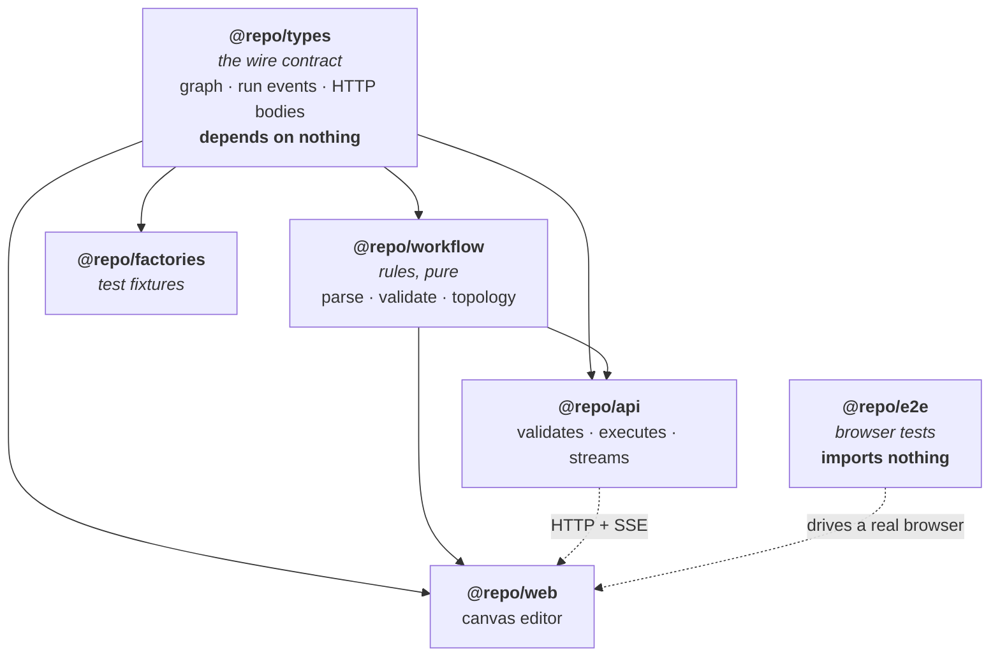
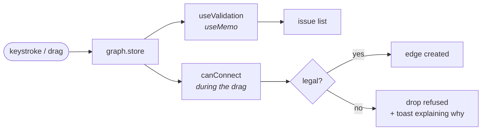
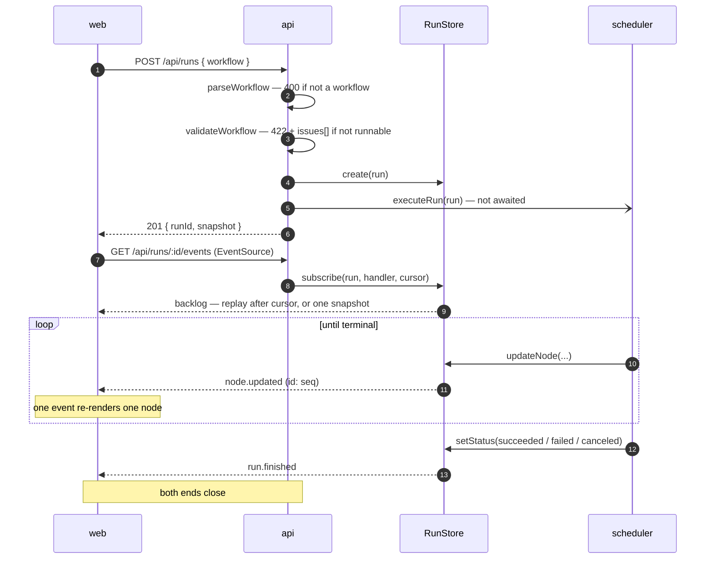

# Architecture

How a workflow gets from the canvas to a stream of live status, and why the
pieces are split the way they are.

## The problem shape

Three things are happening at once, and they change at very different rates:

1. **An authored graph.** Changes only on user intent. Small, and worth keeping.
2. **A validation verdict.** A pure function of (1). Should never be able to
   disagree with it.
3. **A live run.** Changes many times a second, is owned by the server, and is
   disposable.

Most of the design falls out of keeping those three separate and letting each
one be derived from the right source.

## Workspace graph

The boundaries are **dependency rules**, not folders:

- `@repo/types` depends on nothing → the contract can't import an implementation.
- `@repo/workflow` depends only on types, and has no I/O, no DOM, no framework →
  the browser and the server can run **the same validator**, which is what makes
  the client's instant feedback and the server's authority the same rules rather
  than two implementations that drift.
- `@repo/factories` depends only on types → a fixture can't drift toward one
  app's internals.
- `@repo/e2e` depends on **nothing in this repo** → an end-to-end test can only
  assert what a user can observe. Importing the constant the app renders from
  would make a test that asserts a value equals itself.

Both `packages/types` and `packages/workflow` declare `lib: ["ES2023"]` and no
`types` in their tsconfig, so a stray `node:` or `document` import is a compile
error rather than a runtime surprise in whichever environment didn't expect it.

## Request lifecycle

### Editing

Validation is recomputed from the graph rather than stored beside it. There is
no invalidation to forget and no way for the two to disagree.

### Running

The POST reports whether the run was **accepted**, not whether it succeeded.
Everything after acceptance is on the stream. That's what gives the client a run
id it can reconnect with before the first node has even started.

## The seam between frontend and backend

There are exactly three shared things, and they all live in `@repo/types`:

| Shared     | Who produces it | Who consumes it |
| ---------- | --------------- | --------------- |
| `Workflow` | web             | api             |
| `RunEvent` | api             | web             |
| `ApiError` | api             | web             |

Plus one shared _behaviour_, in `@repo/workflow`: `validateWorkflow`. Anything
else the two sides need to agree on would be a new export here rather than a
convention documented in prose.

Because these are consumed as TypeScript source (no build step), a change to the
wire format is a **compile error in the other app**, not a runtime surprise.
`pnpm run typecheck` at the root is the check.

## Where state lives

| State                      | Owner             | Lifetime               |
| -------------------------- | ----------------- | ---------------------- |
| Authored graph             | `web/graph.store` | persisted, per browser |
| Selection                  | `web/graph.store` | in-memory              |
| Validation issues          | derived           | per render             |
| Run status, per-node state | `api/RunStore`    | in-memory, TTL-swept   |
| Client's view of run state | `web/run.store`   | fed by the stream      |
| Resume cursor              | `sessionStorage`  | per tab                |

The client's run state is a **projection of the server's log**, never an
independent copy. That's why cancel doesn't optimistically flip statuses — see
[decisions/0007](./decisions/0007-event-log-resume.md).

## Failure surfaces

Three distinct things can be wrong, and they're presented differently on purpose:

| What           | Where it shows                       | Blocks Run? |
| -------------- | ------------------------------------ | ----------- |
| Graph errors   | issue list, clickable to the node    | yes         |
| Graph warnings | issue list, quieter                  | no          |
| Request failed | red banner (`role="alert"`)          | n/a         |
| Stream dropped | amber banner + pill, says retrying   | n/a         |
| A step failed  | on the node, plus a toast at the end | n/a         |

## Scaling notes

The interview brief mentions 500-node workflows, multiplayer, and durable
execution. Where each of those would land:

**500 nodes.** The streaming path already holds: per-node subscriptions mean
cost is O(events), not O(events × nodes). Two things would give first —
validation on the render path per keystroke (move to a trailing debounce off the
render path, keep only `canConnect` synchronous) and React Flow rendering
everything in the viewport (`onlyRenderVisibleElements`, a prop). The wire format
would want a delta encoding rather than whole-node updates.

**Multiplayer.** `graph.store` is a single mutable document, which is the wrong
shape — it would become a CRDT or an OT document, and `toWorkflow()` becomes the
materialisation point. The run side barely changes: the event log is already a
broadcast log, and multiple subscribers per run already work.

**Durable execution.** The event log is the right foundation and the reason it
exists in this shape. `RunStore` would become an outbox: append to durable
storage, then fan out. `executeRun`'s in-memory `pending`/`outputs` maps become
the thing to persist per step so a restarted process can resume mid-run rather
than from the start. The `create`/`get`/`emit`/`subscribe` interface doesn't
change, which is the point.
