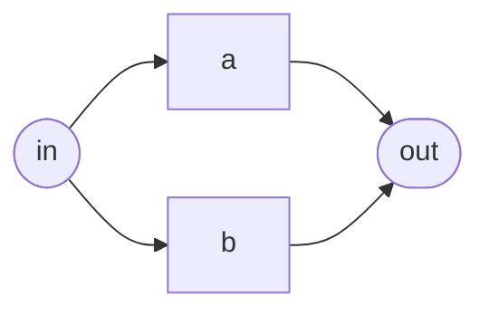

# @repo/factories

Graph fixtures for tests, shared by `@repo/workflow` and `@repo/api`.

```ts
import { diamondWorkflow, node, edge, workflow } from '@repo/factories';

const graph = workflow(
  [node('in', 'input', { value: '' }), node('out', 'output')],
  [edge('in', 'out')],
);
```

Depends on `@repo/types` only — a fixture that reached into an app's internals
would stop being a fixture and start being a second implementation.

## Named topologies

| Factory              | Shape               | What it's for                                                                                                              |
| -------------------- | ------------------- | -------------------------------------------------------------------------------------------------------------------------- |
| `minimalWorkflow()`  | `in → out`          | The smallest legal graph                                                                                                   |
| `linearWorkflow()`   | `in → a → out`      | One of each kind, in a line                                                                                                |
| `diamondWorkflow()`  | `in → (a, b) → out` | `a` and `b` have no ordering between them, so the scheduler must run them concurrently. Most execution tests want this one |
| `twoChainWorkflow()` | two disjoint chains | Proving a failure in one doesn't touch the other                                                                           |
| `cyclicWorkflow()`   | `in → a → b → a`    | The cycle the validator must catch                                                                                         |

The one most execution tests reach for:



`a` and `b` have no ordering between them, so a correct scheduler runs them at
the same time — which is exactly what the concurrency tests assert.

Every builder returns a _valid_ object by default and takes an override, so a
test names only the thing it's about: `node('a', 'input', { value: '' })` reads
as "an input with no value" rather than making the reader diff it against a wall
of boilerplate.
